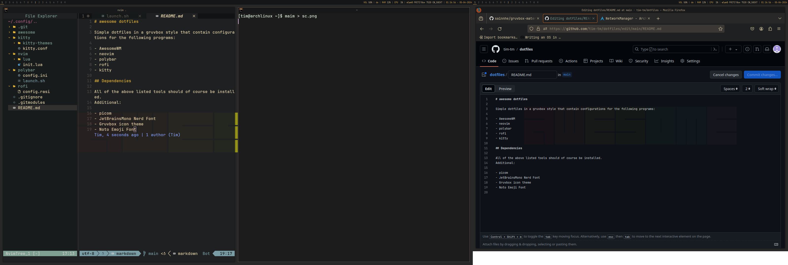
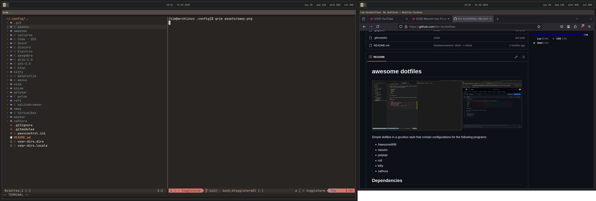

# dotfiles

## awesomewm (X11)

### dependencies
- picom
- Gruvbox icon theme
- Noto Emoji Font
- playerctl
- i3lock
- polybar

## swaywm (Wayland)

### dependencies
- swayidle
- swaylock
- waybar
- grim

## shared dependencies
- JetBrainsMono Nerd Font
- neovim
  - ripgrep (nvim-telescope)
- rofi
- kitty
- zathura
- alsa-utils
